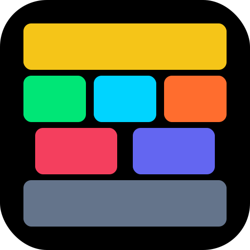
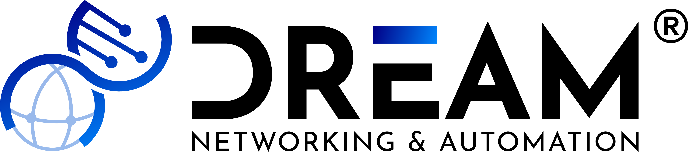
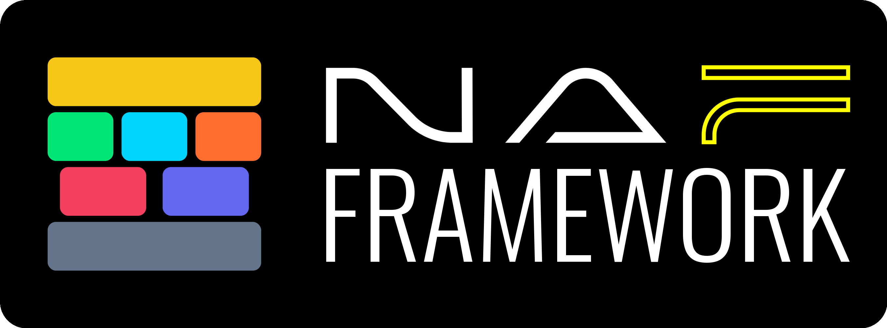
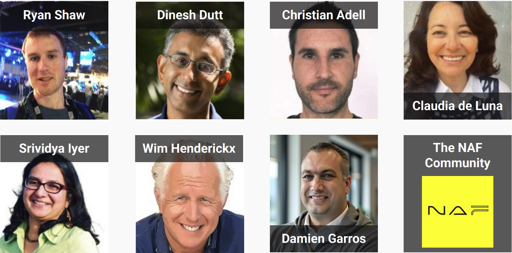
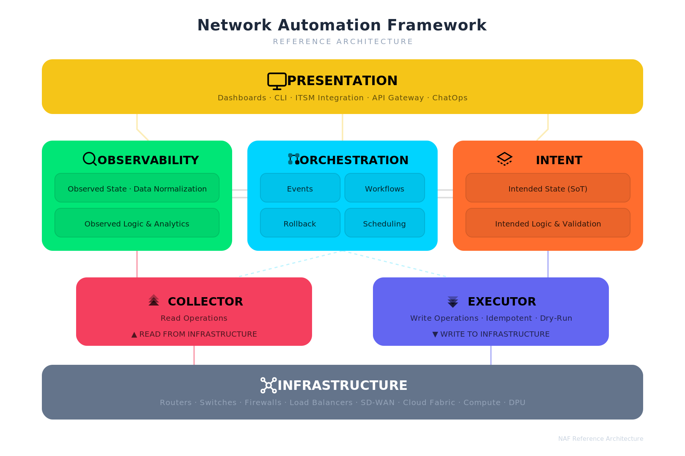
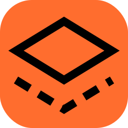
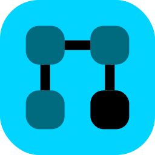
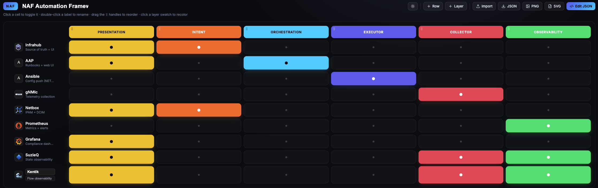

# The NAF Framework

## A shared view for network automation

Six building blocks, one vocabulary

Bart Dorlandt

<!--
The Network Automation Forum framework.

Not a product. Not a stack. A map.
-->

---

## Bart Dorlandt

- Freelance Network Automation Solution Architect
- Lives by: ___There must be a better way___
- Organizer of NLNAM
- Co-organizer of PyUtrecht
- Advisory board member of Network Automation Forum (NAF)

<!--
Hi, I'm Bart.
I've been in networking all my career and I've been in automation half of my career.

People who know me, know I live by: "There must be a better way"
-->
---

## The conversation we keep having

> "We use Ansible, Nautobot, Grafana and a pile of Python."

That answers **what tools we bought/use.**

It does not answer:

- What job does each tool actually do?
- What is missing?
- What is duplicated three times?

<!--
Ask any team what their automation looks like
- and you get a tool list.

A tool list is an inventory, not an architecture.
-->

---

## Starting from tools is backwards

- No consensus on what the tool should do
- Two tools own the same or overlapping data
- Nobody can say *where* the next feature belongs
- Onboarding = tribal knowledge transfer

**We had no shared vocabulary to talk about the problem.**

<!--
Comparing two designs is difficult or
  impossible if nobody speaks the same language.

Difficult to align between teammates, let alone other teams.
  Going non-technical or upstream is near impossible.
-->

---

## Enter the NAF Framework

A **modular, vendor-neutral reference model** for network automation.

- Published by the Network Automation Forum
- Defines **functional building blocks**, not products
- Design around required functionality — *then* pick tools

<!--
Written by practitioners, not by a single vendor

Key phrase: functional building blocks that can be composed into tools.

Focus on a shared understanding, intra-team, inter-team and inter-vendor.
    Also allows you to explain it to the CEO
-->

---

## The workgroup

<!-- _class: map -->

<!--
Again, Not a single vendor.

It got started by Ryan, having weekly calls on Fridays. I was there in the beginning, but I also had my kids running around... Challenging...

It took some time to align, yet now we have a great starting point for a reference model.

From the different views on tools, and disagreements on tools, came a shared understanding of the problem space, and a shared vocabulary to talk about it.
-->

---

<!-- _class: map -->

<!--
Six blocks plus the network infrastructure at the bottom.
Write side on one flank, read side on the other, coordination in the middle,
humans on top.

| Block         | Job                                                |
| ------------- | -------------------------------------------------- |
| Intent        | Store and shape the **desired** state              |
| Executor      | **Write** changes to the network                   |
| Collector     | **Read** the actual state from the network         |
| Observability | Persist and process the **actual** state           |
| Orchestrator  | **Coordination** role, tasks in response to events |
| Presentation  | Where **humans** (or machines) meet the system     |
-->

---

<!-- _class: block -->

## Intent

> Defines the logic to handle and the persistence layer to store the desired state of the network, including both configuration and operational expectations

MUSTbe capable of representing, in a structured form, any network-related aspect

MUSTsupport create, read, update, and delete operations

MUSTbe exposed through a standardized, well-documented API

SHOULDprovide a consistent and unified view of the desired state

SHOULDuse a neutral representation that will be derived into vendor-specific configuration artifacts

SHOULDinclude metadata that supports effective data governance

SHOULDbe transactional, and provide versioned access to data

MAYinclude all the logic related to intended state management

<!--
This is your intent data (SoT). Note "one consistent view" does not mean "one database" - it may be federated across sources.

Not going to match tools to the blocks just yet.
-->

---

<!-- _class: block -->

## Executor

> Encompasses the actual tasks applied to the network to drive changes (e.g., updating configuration) as guided by the intended state.

MUSTbe capable of interacting with any of the supported network write interfaces

SHOULDcome from the intended state or be derived from it

SHOULDsupport any network operation that alters the network state

SHOULDprovide a dry-run operation to check the expected result of the execution

SHOULDsupport transactional execution of the changes

MAYsupport both imperative and declarative approaches

<!--
SSH, NETCONF, RESTCONF, SNMP, CLI, etc.
-->

---

<!-- _class: block -->

## Collector

> Focuses on retrieving (i.e., reading) the actual state of the network

MUSTinclude capabilities for retrieving live data from the network using read interfaces (push, pull)

<!--
Splitting read from write is the single most useful line in the whole
framework. Most homegrown stacks blur them and then cannot tell you
whether they are describing reality or ambition.

SSH, API, SNMP, CLI, gRPC, gNMIc, metrics, logs, flows, packet captures, etc.
-->

---

<!-- _class: block -->

## Observability

> Stores the actual network state, and defines the logic to process the observed data.

MUSTsupport historical data persistence

MUSToffer programmatic access to this data

SHOULDoffer a capable query language to extract the data

SHOULDexpose relevant insights into the current network state

SHOULDautomatically generate events when discrepancies are detected

SHOULDnormalize data into a vendor-agnostic data model

MAYhave events processed by humans or connected to the Orchestrator

MAYbe enriched with contextual information from the intended state

<!--
Sources: Logs, Metrics, traces, flows, Packet Captures, State, Config, Probes

This is where drift detection lives. Compare intent to reality, emit an event.
That event either reaches a human or the Orchestrator.

Push/Pull/Both - Protocol?

Collector > Normalization > Enrichment > Storage > Query | Event | Insights logic
-->

---

<!-- _class: block -->

## Orchestrator

> Coordinates activities across various building blocks

MUSTenable coordination of processes across the various building blocks

SHOULDfollow an event-driven approach for process execution

SHOULDprovide a dry-run operation to check the expected result of the workflow

SHOULDprovide the ability to schedule the execution of a workflow

SHOULDallow execution logic to perform reverse/compensating actions

SHOULDprovide logging and traceability of past and current workflows

MAYinclude logic to correlate multiple events and infer relationships

<!--
**Coordination. Never touches the network directly.**
- Event-driven: synchronous, asynchronous or scheduled
- Compensating actions for controlled rollback
- Dry-run of a whole workflow
- Logging and traceability of past and current runs
- MAY correlate events and infer the right response

Note the boundary: the Orchestrator calls the Executor, it does not SSH
anywhere itself. If your workflow engine has device credentials, you have
merged two blocks.
-->

---

<!-- _class: block -->

## Presentation

> Provides the interfaces through which users interact with the system, including dashboards, graphical user interfaces

MUSTprovide robust authentication and authorization capabilities

MAYsupport both read and write interactions

MAYtake various forms depending on the needs of the end user

> This does **not** imply a single pane of glass.

<!--
**The human contact point.**

- Dashboards, GUIs, ITSM, change management, chat, docs portals
- Read *and* write: view data, start tasks, approve changes

-->

---

<!-- _class: map -->

<!-- Quick overview again -->
---

## The rules that make it work

- Blocks are **functions**, not products
- One block MAY be many components — or one tool MAY cover several blocks
- Everything exposes a machine-friendly, schema-documented API
- Version control and CI/CD for all of it
- Make operations idempotent and transactional where possible

<!--
Nautobot is intent plus presentation. Ansible is executor plus a bit of
orchestration.

That is fine - as long as you know which hat it wears.

But you may need to think of where does my batfish validation go?
Do you have automated end-to-end validation with containerlab, where does that go?

(Not for now to discuss, at the end or in the break)
-->

---

## How to actually use it

1. **Map** what you have onto the six blocks
2. Look for the **empty** boxes
3. Look for the **crowded** boxes — multiple tools writing the same data
4. Pick the one gap that hurts most; fill only that
5. Repeat

**The map is not a shopping list.**

<!--
An hour with a whiteboard and these six words/boxes is worth more than a
year-long tool evaluation.
-->

---

## What you get out of it

- A vocabulary your whole team shares
- A place to put every new requirement
- An honest picture of duplication and gaps
- Vendor conversations on *your* terms: "which block do you fill?"
- A way to start narrow without painting yourself into a corner

<!--
The framework does not tell you what to buy. It tells you what question to ask.

Last statement, You are not forced to do it all at once.
-->

---

## Call to Action

Take your own stack and ask:

1. **Where is my intent?** Is it a database or a set of habits?
2. **Can I see drift?** Actual state versus intended state, automatically?
3. **Who writes?** Does anything besides the Executor touch the devices?
4. **What is the one empty box?** Start there.

<!--
Let's have a chat in November at the next NLNAM and see what you have learned.
-->

---
## NAF Matrix - Christian Drefke

https://naf-framework-solution-matrix.vercel.app/

<!--
Use this to make it nice and easy!
Easy to create, export/import save to png etc.
-->
---

## Q&A

- Bart Dorlandt
- https://linkedin.com/in/bartdorlandt/
- https://dreamnetworking.nl/
- https://net-auto.nl/

The framework:
[reference.networkautomation.forum/Framework/Framework](https://reference.networkautomation.forum/Framework/Framework/)

